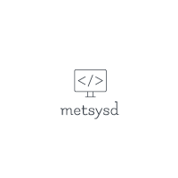

<div align="center">
  <a href="https://github.com/AlexandreBrg/metsysd">
    
  </a>
  <p align="center">
    <br />
    This little program will create a systemd service through a command line, only works on Linux, obviously 😉.  
    <br />
    <br />
    <a href="https://github.com/AlexandreBrg/metsysd/issues">Report Bug</a>
    ·
    <a href="https://github.com/AlexandreBrg/metsysd/issues">Request Feature</a>
  </p>
</div>


<!-- TABLE OF CONTENTS -->
<details>
  <summary>Table of Contents</summary>
  <ol>
    <li>
      <a href="#about-the-project">About The Project</a>
      <ul>
        <li><a href="#built-with">Built With</a></li>
      </ul>
    </li>
    <li>
      <a href="#getting-started">Getting Started</a>
      <ul>
        <li><a href="#prerequisites">Prerequisites</a></li>
        <li><a href="#installation">Installation</a></li>
      </ul>
    </li>
    <li><a href="#usage">Usage</a></li>
    <li><a href="#contributing">Contributing</a></li>
  </ol>
</details>


<!-- ABOUT THE PROJECT -->
## About The Project

Here's a blank template to get started: To avoid retyping too much info. Do a search and replace with your text editor for the following: `github_username`, `repo_name`, `twitter_handle`, `linkedin_username`, `email_client`, `email`, `project_title`, `project_description`

<p align="right">(<a href="#readme-top">back to top</a>)</p>


<!-- GETTING STARTED -->
## Getting Started

In order to get started, you just have to download the binary from the latest release. There are builds for `amd64` and 
`arm64` architectures. Once you got the binary, you are ready to go !

```shell
Metsysd is a simple systemd service generator, because we never remember systemd service syntax

Usage: metsysd [OPTIONS] <COMMAND>

Arguments:
  <COMMAND>
          The command which will be executed when running the service

Options:
  -n, --name <NAME>
          Name of the service you want to create

      --service-type <SERVICE_TYPE>
          Defines the kind of service you want to run
          
          See https://www.freedesktop.org/software/systemd/man/systemd.service.html#Type= for more information
          
          [possible values: simple, forking, oneshot, idle]

      --restart <RESTART>
          Defines the restart policy of the service
          
          [possible values: always, on-failure, on-success, no]

      --user <USER>
          Specify the user running the service (it must exist)

      --group <GROUP>
          Specify the group running the service (it must exist)

      --is-user
          Defines your service as a service from your user (rootless). The service will start when the user runs a session on the host

      --install-dir <INSTALL_DIR>
          Define the directory to which the service should be installed. Only use when you know what you're doing

      --daemon-reload
          Run daemon-reload when service has been created

  -d, --dry-run
          Output the generated service in the console, instead of creating it

  -h, --help
          Print help information (use `-h` for a summary)

  -V, --version
          Print version information
```

### Prerequisites

You only need a linux system that is running systemd to manage services.

### Setup development environment

1. Clone the repo
   ```sh
   git clone https://github.com/AlexandreBrg/metsysd.git
   ```
2. Install dependencies
   ```sh
   cargo install --path .
   ```
3. You are ready to rock !

<p align="right">(<a href="#readme-top">back to top</a>)</p>


<!-- USAGE EXAMPLES -->
## Usage

*You need to be root (or privileged) in order to create system-wide services. If you are not privileged, you can
create a user scoped service*.

* Create a system-wide service that runs a binary
  ```shell
  metsysd --service-type simple --restart always \
    --name "my-service" "/usr/bin/sleep 3600"
  ```
  
* Create a system-wide service that runs a binary called and runs as a specific user and group
  ```shell
  metsysd --service-type simple \
    --restart always --name "my-service" \
    --user "my-user" --group "my-group" \
   "/usr/bin/sleep 3600"
  ```
  
* Create a system-wide service that runs a binary and is a one-shot service
  ```shell
  metsysd --service-type oneshot \
    --restart no --name "my-service" \
    "/usr/bin/sleep 3600"
  ```

* Create a user scoped service that runs a binary
  ```shell
  metsysd --service-type simple --restart always \
    --name "my-service" --is-user "/usr/bin/sleep 3600"
  ```

<p align="right">(<a href="#readme-top">back to top</a>)</p>

<!-- CONTRIBUTING -->
## Contributing

Contributions are what make the open source community such an amazing place to learn, inspire, and create. Any contributions you make are **greatly appreciated**.

If you have a suggestion that would make this better, please fork the repo and create a pull request. You can also simply open an issue with the tag "enhancement".
Don't forget to give the project a star! Thanks again!

1. Fork the Project
2. Create your Feature Branch (`git checkout -b feature/AmazingFeature`)
3. Commit your Changes (`git commit -m 'Add some AmazingFeature'`)
4. Push to the Branch (`git push origin feature/AmazingFeature`)
5. Open a Pull Request

*Please remember community rules, see [Github Contributing](https://github.com/github/docs/blob/main/CONTRIBUTING.md) for 
more informations.*

<p align="right">(<a href="#readme-top">back to top</a>)</p>